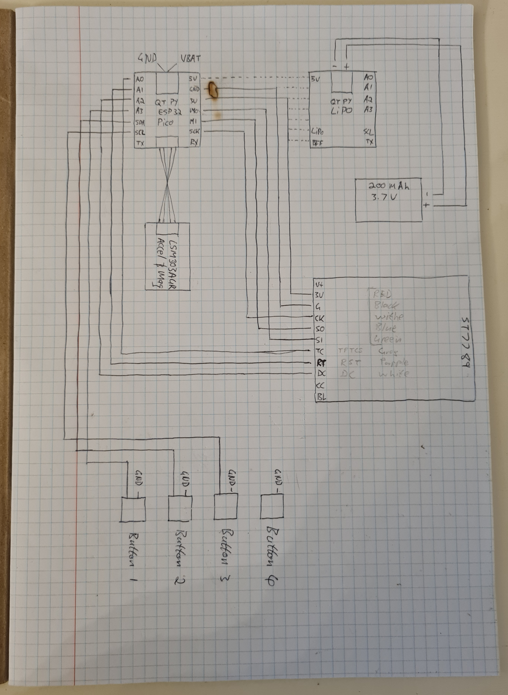
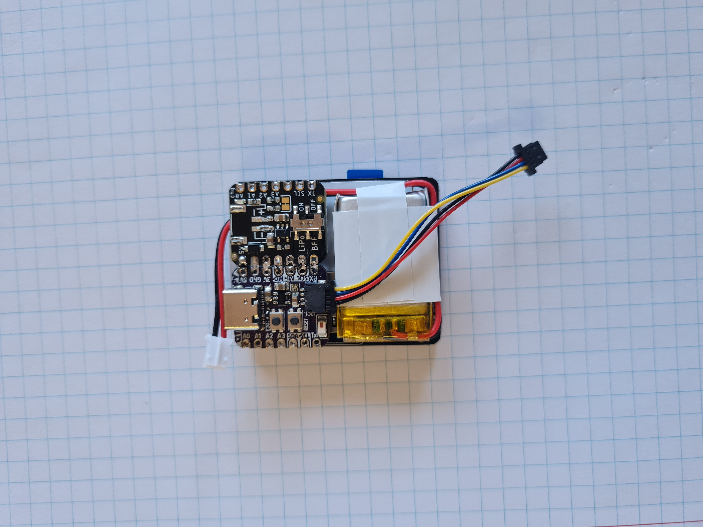

# Smart-Watch

In my spare time I thought it could be a cool idea to build my own Smart Watch.

https://user-images.githubusercontent.com/40139531/184817293-4f2a9607-cb99-414f-9b66-a0cfe052e9a7.mp4

### I made use of the following Four boards:

Adafruit QT Py ESP32 Pico - WiFi Dev Board with STEMMA QT - 8MB Flash 2MB PSRAM

> https://www.adafruit.com/product/5395

Adafruit LiIon or LiPoly Charger BFF Add-On for QT Py

> https://www.adafruit.com/product/5397

Adafruit 1.69" 280x240 Round Rectangle Color IPS TFT Display - ST7789

> https://www.adafruit.com/product/5206

Adafruit LSM303AGR Accelerometer Magnetometer - STEMMA QT Qwiic

> https://www.adafruit.com/product/4413

### The diagram below shows How the are to be connected:

